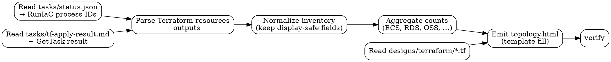

# Architecture Topology HTML Generation Guide

> **Purpose** — Tell another agent exactly how to turn an Alibaba Cloud Terraform
> project plus its RunIaC apply result into a single self-contained HTML page
> that renders an architecture topology diagram in a clean Google-light style,
> plus a Chinese resource overview, a key-access strip, a resource-detail grid,
> and a Terraform outputs table.
>
> **Reference output** — `.aliyun-ai-ops-spec/python-web/topology.html` (the
> "golden" example this guide was extracted from).
>
> **When to use** — Whenever a user (or another skill) asks for a visual
> topology / architecture overview HTML based on a Terraform project that has
> been applied via `alibabacloud-spec-ops.AlibabaCloud___RunIaC`.

---

## 0. TL;DR — what the agent must produce

A **single self-contained HTML file** at
`<project-root>/topology.html` (or wherever the user requests) that:

1. Loads no JS frameworks. Pure HTML + CSS + vanilla JS in one file.
2. Loads only Google Fonts (Google Sans / Roboto / Roboto Mono) over HTTPS.
3. Renders six sections in this exact vertical order:
   1. Sticky top bar (project name, status pills)
   2. **本次架构概览** — Chinese resource summary (top priority)
   3. 关键访问信息 — IPs / endpoints / 创建成功时间 (UTC+8)
   4. Architecture topology canvas (nested frames + SVG arrows)
   5. Provisioned resources grid
   6. Terraform outputs table + footer
4. Renders correctly at 1440 px viewport with **0 console errors**.
5. Collapses gracefully under 980 px.
6. Uses **Chinese labels** for the overview / access-info / outputs section
   headings; English is OK in technical IDs and resource type names.

If any of these is missing the output is non-conforming.

---

## 1. Inputs and how to fetch them

| Input | Path / Source | How to read |
|---|---|---|
| RunIaC process IDs | `<project>/tasks/status.json` → `state.last_process_id`, `state.last_apply_process_id` | `Read` tool |
| Terraform template | `<project>/designs/terraform/main.tf` (and any other `*.tf` in that folder) | `Read` tool |
| Apply result | `<project>/tasks/tf-apply-result.md` plus the terminal `AlibabaCloud___GetTask` result captured by `alibabacloud-executing-plans` | `Read` tool |

The RunIaC/GetTask terminal response exposes outputs in `result` and the
workflow records the plan/apply summaries under `tasks/`. Unlike the legacy
IaCService `get-execute-state` path, this guide must not call
`aliyun iacservice get-execute-state` directly.

```json
{
  "processID": "iac_xxx",
  "status": "Succeeded",
  "nextAction": "None",
  "result": {
    "output_name": {
      "value": "..."
    }
  }
}
```

When raw Terraform state is unavailable, build the topology inventory from the
Terraform resources declared in `designs/terraform/*.tf`, the apply result
resource table, and the RunIaC outputs. Do not invent provider attributes that
are absent from these inputs.

---

## 2. End-to-end workflow



Concrete tool order:

```
1. Read   .../<project>/tasks/status.json
2. Read   .../<project>/designs/terraform/main.tf
3. Read   .../<project>/tasks/tf-apply-result.md
4. Bash   python3  → parse + normalize + count → /tmp/<project>-topology.json
5. Write  .../<project>/topology.html  (using the template skeleton in §10)
6. Bash   python3 -m http.server <port>  (background)
   open the html page using default broswer
7. Cleanup screenshots, kill server
```

Always run step 6. Skipping verification = guessing.

---

## 3. Inventory extraction (Python recipe)

Run inside Bash. Persists a slim inventory to `/tmp/<project>-inventory.json`
so it can be re-read by later steps without bloating the agent's context.

```python
import json, os, re
from pathlib import Path

PROJECT = os.environ.get('PROJECT', 'project')
ROOT = Path(os.environ['PROJECT_ROOT'])
STATUS = json.loads((ROOT / 'tasks/status.json').read_text())
APPLY_MD = (ROOT / 'tasks/tf-apply-result.md').read_text()
TF_TEXT = '\n'.join(p.read_text() for p in sorted((ROOT / 'designs/terraform').glob('*.tf')))

def hcl_blocks(kind):
    pat = re.compile(rf'{kind}\s+"([^"]+)"(?:\s+"([^"]+)")?\s*\{{', re.M)
    for m in pat.finditer(TF_TEXT):
        yield {
            'kind': kind,
            'type': m.group(1),
            'name': m.group(2),
            'address': f'{m.group(1)}.{m.group(2)}' if m.group(2) else m.group(1),
        }

resources = list(hcl_blocks('resource'))
outputs = {}
for line in APPLY_MD.splitlines():
    m = re.match(r'\|\s*([A-Za-z0-9_-]+)\s*\|\s*(.*?)\s*\|$', line)
    if m and m.group(1).lower() not in {'name', '---'}:
        outputs[m.group(1)] = {'value': m.group(2)}

inventory = {
    'status': STATUS.get('status'),
    'last_apply_at': STATUS.get('state', {}).get('last_apply_at'),
    'resources': resources,
    'outputs': outputs,
    'apply_result_markdown': APPLY_MD,
}

with open(f'/tmp/{PROJECT}-inventory.json', 'w') as f:
    json.dump(inventory, f, ensure_ascii=False, indent=2)
```

If the terminal `AlibabaCloud___GetTask` result is still available in context,
merge its `result` outputs into `inventory.outputs`. Treat HCL declarations,
`tf-apply-result.md`, and GetTask outputs as the only authoritative inputs.
Never invent provider attributes that are absent from these inputs.

---

## 4. Aggregation rules — what to count for 「本次架构概览」

For each `inventory['resources']` entry, classify by `type` then aggregate.
Only `resource` blocks count; skip `data` blocks.

| Stat label (zh) | What it counts | Sub-line shown under value |
|---|---|---|
| 资源总数 | `len(resources)` | 固定文本 `Terraform 托管` |
| ECS 云服务器 | count of `alicloud_instance` | `<instance_type> · <zone>` (first instance) |
| RDS 云数据库 | count of `alicloud_db_instance` | `<engine> <engine_version> <category> · <zone>` |
| OSS 存储桶 | count of `alicloud_oss_bucket` | `<storage_class> · 私有/公有 · 加密算法` |
| 公网 IP (EIP) | count of `alicloud_eip_address` | `<ip_address> · <bandwidth> Mbps` |
| VPC / 交换机 | `count(alicloud_vpc)` / `count(alicloud_vswitch)` | `<vpc_cidr> · <vswitch_cidr>` |
| 安全组规则 | count of `alicloud_security_group_rule` | `SSH 22 · HTTP 80 · HTTPS 443` (first 3 protocols) |
| RAM 角色 / 策略 | `count(alicloud_ram_role)` / `count(alicloud_ram_policy)` | one-line description of the trust path |
| SLB / ALB / NLB | count of corresponding `alicloud_*_load_balancer*` | listener summary if available |
| ACK 集群 | count of `alicloud_cs_kubernetes*` | `<cluster_spec>` |
| FC 函数 | count of `alicloud_fcv3_function` | `<runtime>` |

If a category has 0, **omit the card** rather than show "0 个". The overview
should always read like a positive inventory.

---

## 5. Required sections (vertical order, top to bottom)

```
┌─────────────────────────────────────────────────────────────┐
│  Top bar (sticky)                                           │
│  [logo] project-name      ┃ status pills (Applied/region/zone)│
├─────────────────────────────────────────────────────────────┤
│  📋 本次架构概览  (light-blue gradient card)                  │
│  ┌─ resource count grid (auto-fit, min 168px) ─────────────┐│
│  │  [ic] 资源总数 21 个   [ic] ECS 1 台   [ic] RDS 1 台 …   ││
│  └──────────────────────────────────────────────────────────┘│
├─────────────────────────────────────────────────────────────┤
│  关键访问信息  (5 small monospace cards, no State ID)         │
│  公网 IP · 内网 IP · RDS 连接地址 · OSS 存储桶 · 创建成功时间   │
├─────────────────────────────────────────────────────────────┤
│  ARCHITECTURE TOPOLOGY  (white card with SVG overlay)        │
│  ┌──────┐ ┌─ Region ─ VPC ─ VSwitch ─ SG ─┐ ┌──────┐         │
│  │Internet│ │  [ECS]  [RDS]                │ │ OSS  │         │
│  │  EIP  │ │                                │ │ RAM  │         │
│  └──────┘ └────────────────────────────────┘ └──────┘         │
│  arrows: blue (public), purple (IAM), grey-dashed (data)      │
├─────────────────────────────────────────────────────────────┤
│  PROVISIONED RESOURCES · N managed   (auto-fit 300px cards)  │
├─────────────────────────────────────────────────────────────┤
│  TERRAFORM OUTPUTS  (zebra-free table, monospace values)     │
├─────────────────────────────────────────────────────────────┤
│  Footer (provider version + state-source attribution)        │
└─────────────────────────────────────────────────────────────┘
```

Section headings (ALL UPPERCASE in source) act as horizontal rule separators —
see `.section-title::after` in §6.

---

## 6. Visual design tokens (DO NOT EDIT)

These are the canonical Google-light tokens. New topologies must reuse them
verbatim or the family-resemblance breaks.

```css
:root {
  --bg: #f8f9fa;
  --surface: #ffffff;
  --surface-2: #f1f3f4;
  --border: #dadce0;
  --border-soft: #e8eaed;

  --text: #202124;
  --text-secondary: #5f6368;
  --text-tertiary: #80868b;

  --blue: #1a73e8;        --blue-soft: #e8f0fe;       --blue-strong: #185abc;
  --green: #1e8e3e;       --green-soft: #e6f4ea;
  --yellow: #f9ab00;      --yellow-soft: #fef7e0;
  --red: #d93025;         --red-soft: #fce8e6;
  --purple: #9334e6;      --purple-soft: #f3e8fd;
  --teal: #129eaf;        --teal-soft: #def7f9;

  --shadow-1: 0 1px 2px 0 rgba(60,64,67,.08), 0 1px 3px 1px rgba(60,64,67,.06);
  --shadow-2: 0 1px 2px 0 rgba(60,64,67,.10), 0 2px 6px 2px rgba(60,64,67,.08);

  --radius: 12px;
  --radius-sm: 8px;
  --radius-pill: 999px;
}
```

Typography:

- `font-family: 'Google Sans', 'Roboto', system-ui, sans-serif;`
- IDs / IPs / CIDRs / endpoints **always** wrapped in `'Roboto Mono', monospace`.
- Body 14 px, line-height 1.5, antialiased.

Color → resource family mapping (icon background tints):

| Resource family | Class | Use for |
|---|---|---|
| Network / compute primary | `ic-blue` | VPC, VSwitch (compute-side), ECS, EIP, NAT |
| Storage | `ic-green` | OSS, NAS, file storage |
| Database | `ic-teal` | RDS, PolarDB, Redis, MongoDB |
| Security | `ic-yellow` | Security group + rules, WAF, KMS |
| Identity | `ic-purple` | RAM role / policy / attachment |
| Utility / glue | `ic-grey` | random_string, associations, attachments |
| Errors / dangerous | `ic-red` | Optional — destroyed / failed resources |

---

## 7. Component templates

### 7.1 Top bar

```html
<header class="topbar">
  <div class="topbar-left">
    <div class="logo">PY</div>          <!-- 2-letter project initials -->
    <div>
      <h1>python-web</h1>
      <div class="subtitle">Architecture topology · Terraform managed</div>
    </div>
  </div>
  <div class="topbar-right">
    <span class="pill applied dot">Applied</span>
    <span class="pill">cn-beijing</span>
    <span class="pill">cn-beijing-i</span>
  </div>
</header>
```

Logo gradient: `linear-gradient(135deg, #4285f4 0%, #1a73e8 100%)`. Always 2
uppercase letters derived from the project name.

### 7.2 「本次架构概览」card

The whole block is wrapped in `<section class="overview">` with a soft
`linear-gradient(180deg, #f8faff 0%, #ffffff 100%)` background and a
`#d2e3fc` 1 px border.

```html
<section class="overview">
  <div class="overview-head">
    <h2>本次架构概览</h2>
    <div class="head-meta">
      <span>地域：<b>{region_zh} · {region}</b></span>
      <span>·</span>
      <span>可用区：<b>{zone}</b></span>
      <span>·</span>
      <span>创建成功时间：<b>{utc8_time}</b></span>
    </div>
  </div>
  <div class="overview-grid">
    <!-- one .stat block per category from §4, omit categories with count=0 -->
    <div class="stat">
      <div class="stat-ic ic-blue"><svg ...>{icon}</svg></div>
      <div class="stat-body">
        <div class="stat-label">{zh_label}</div>
        <div class="stat-value">{count} 个/台/条</div>
        <div class="stat-sub">{sub_detail}</div>
      </div>
    </div>
  </div>
</section>
```

Counter unit by category (Chinese measure word):
`ECS/RDS/SLB/ACK 节点 → 台`,
`OSS/EIP/VPC/VSwitch/RAM 等 → 个`,
`安全组规则 → 条`.

### 7.3 关键访问信息 strip

```html
<section class="summary">
  <div class="summary-card"><div class="k">公网 IP (EIP)</div>
    <div class="v">{ip}</div></div>
  <div class="summary-card"><div class="k">内网 IP (ECS)</div>
    <div class="v">{private_ip}</div></div>
  <div class="summary-card"><div class="k">RDS 连接地址</div>
    <div class="v v-sm">{conn_string}:{port}</div></div>
  <div class="summary-card"><div class="k">OSS 存储桶</div>
    <div class="v v-sm">{bucket}</div></div>
  <div class="summary-card"><div class="k">创建成功时间</div>
    <div class="v v-sm">{utc8_date_only}<br>
      <span style="font-size:12px;color:var(--text-tertiary);
                   font-family:'Google Sans',sans-serif">UTC+8 · 北京时间</span>
    </div>
  </div>
</section>
```

Rules:

- Use 4 to 6 cards. Skip cards with no data (e.g. no SLB → skip SLB card).
- **Never** include RunIaC `processID` or `last_validation_id` — those are operator
  metadata and clutter the UX.
- 创建成功时间 is always **last** and always uses UTC+8 (see §11).

### 7.4 Topology canvas

```html
<section class="section">
  <h2 class="section-title">Architecture Topology</h2>
  <div class="topology" id="topology">
    <svg class="topology-svg" id="topology-svg" xmlns="http://www.w3.org/2000/svg">
      <defs>
        <marker id="arrow-blue"   ...><path fill="#1a73e8" .../></marker>
        <marker id="arrow-grey"   ...><path fill="#80868b" .../></marker>
        <marker id="arrow-purple" ...><path fill="#9334e6" .../></marker>
      </defs>
    </svg>

    <div class="topology-grid">
      <div class="external">          <!-- LEFT: ingress chain -->
        <div class="internet-card" data-anchor="internet">…</div>
        <div class="res-card"      data-anchor="eip">…</div>
      </div>

      <div class="frame frame-region">  <!-- CENTER: nested frames -->
        <div class="frame frame-vpc">
          <div class="frame frame-az">
            <div class="frame frame-sg">
              <div class="compute-grid">
                <div class="res-card" data-anchor="ecs">…</div>
                <div class="res-card" data-anchor="rds">…</div>
              </div>
            </div>
          </div>
        </div>
      </div>

      <div class="external">          <!-- RIGHT: regional / IAM -->
        <div class="res-card" data-anchor="oss">…</div>
        <div class="res-card" data-anchor="ram">…</div>
      </div>
    </div>
  </div>
</section>
```

Three-column grid is fixed: `220px 1fr 220px`. Center stays fluid; the two
gutters host external/regional cards.

#### Frame label/meta convention

Each `.frame` exposes its identity through two pinned chips:

- `.frame-label` (top-left, colored): family + name. e.g. `VPC · python-web-vpc`
- `.frame-meta` (top-right, mono, secondary): CIDR + ID short form

Frame variants: `frame-region` (light blue), `frame-vpc` (blue), `frame-az`
(green), `frame-sg` (yellow). One per nesting level — never two of the same
class nested inside each other.

### 7.5 Resource cards

```html
<div class="res-card">
  <div class="head">
    <div class="ic ic-blue"><svg viewBox="0 0 24 24" ...>{icon}</svg></div>
    <div>
      <div class="name">{display_name}</div>
      <div class="kind">{terraform_address}</div>
    </div>
  </div>
  <div class="body">
    <div class="row"><span class="label">Type</span>
      <span class="value">{instance_type}</span></div>
    <!-- 3-5 rows max; truncate the rest -->
  </div>
  <div class="footer">
    <span class="pill running dot">Running</span>
    <span class="id-tag" title="{full_id}">{full_id}</span>
  </div>
</div>
```

Body row count: **3 to 5**. More than that and the card grows unbalanced; less
than 3 looks empty.

Status pill mapping (use `.dot` modifier so it gets a leading dot):

| Terraform/runtime status | Pill class |
|---|---|
| `Running`, `Available`, `Active`, `Online`, `InUse` | `running` (green) |
| `Stopped`, `Disabled` | yellow (no class — fall back to neutral pill) |
| `Failed`, `Error`, `Tainted` | `red` (add to CSS if you encounter one) |
| Unknown / no status | omit pill |

### 7.6 Provisioned resources grid

`<div class="resource-grid">` with `repeat(auto-fill, minmax(300px, 1fr))`.
Render **one card per managed resource** (exclude data sources). Sort
alphabetically by Terraform address (`type.name`) so re-runs are stable.

### 7.7 Outputs table

```html
<div class="outputs">
  <table>
    <thead><tr><th style="width:32%">Name</th><th>Value</th></tr></thead>
    <tbody>
      <tr><td>{output_name}</td><td>{output_value}</td></tr>
    </tbody>
  </table>
</div>
```

If an output value is sensitive (`output.sensitive == true`), render the value
as `••••••` with `title="(sensitive)"`. Never inline the secret.

### 7.8 Footer

```html
<footer class="footer">
  <span>Source · main.tf (alicloud provider {version}) · Terraform {tf_version}</span>
  <span>Generated from <code>AlibabaCloud___RunIaC</code> / <code>AlibabaCloud___GetTask</code></span>
</footer>
```

---

## 8. SVG icon library

All icons share these attributes:
`viewBox="0 0 24 24" fill="none" stroke="currentColor" stroke-width="2"
 stroke-linecap="round" stroke-linejoin="round"`. Width/height inherit from the
`.ic` container (18 px in cards, 20 px in stats, 26 px in `.ic-big`).

| Key | Use for | Path data |
|---|---|---|
| `vpc` | VPC | `<path d="M3 6h18v12H3z"/><path d="M3 12h18M9 6v12M15 6v12"/>` |
| `vswitch` | VSwitch / subnet | `<rect x="3" y="4" width="18" height="6" rx="1"/><rect x="3" y="14" width="18" height="6" rx="1"/><path d="M7 10v4M17 10v4"/>` |
| `shield` | Security group | `<path d="M12 2l8 4v6c0 5-3.5 9-8 10-4.5-1-8-5-8-10V6z"/>` |
| `lock` | SG rule, OSS ACL | `<rect x="4" y="11" width="16" height="10" rx="2"/><path d="M8 11V7a4 4 0 0 1 8 0v4"/>` |
| `server` | ECS / GPU instance | `<rect x="2" y="4" width="20" height="14" rx="2"/><path d="M8 22h8M12 18v4"/>` |
| `globe` | Internet, EIP | `<circle cx="12" cy="12" r="9"/><path d="M3 12h18M12 3a13 13 0 0 1 0 18M12 3a13 13 0 0 0 0 18"/>` |
| `link` | Association / attachment | `<path d="M10 13a5 5 0 0 0 7.07 0l3-3a5 5 0 1 0-7.07-7.07l-1.5 1.5"/><path d="M14 11a5 5 0 0 0-7.07 0l-3 3a5 5 0 0 0 7.07 7.07l1.5-1.5"/>` |
| `db` | RDS / Redis / Mongo | `<ellipse cx="12" cy="5" rx="9" ry="3"/><path d="M3 5v6c0 1.66 4 3 9 3s9-1.34 9-3V5"/><path d="M3 11v6c0 1.66 4 3 9 3s9-1.34 9-3v-6"/>` |
| `user` | RAM role / DB account | `<circle cx="12" cy="8" r="4"/><path d="M4 21v-1a8 8 0 0 1 16 0v1"/>` |
| `key` | RAM policy / privilege | `<circle cx="8" cy="15" r="4"/><path d="M11 13l8-8M17 7l3 3M14 10l3 3"/>` |
| `backup` | Backup policy | `<path d="M21 12a9 9 0 1 1-3-6.7"/><path d="M21 4v6h-6"/>` |
| `bucket` | OSS / NAS | `<path d="M21 8a2 2 0 0 0-1-1.73l-7-4a2 2 0 0 0-2 0l-7 4A2 2 0 0 0 3 8v8a2 2 0 0 0 1 1.73l7 4a2 2 0 0 0 2 0l7-4A2 2 0 0 0 21 16z"/><path d="M3.27 6.96L12 12.01l8.73-5.05M12 22.08V12"/>` |
| `hash` | random / generated | `<path d="M4 9h16M4 15h16M10 3L8 21M16 3l-2 18"/>` |

If a new resource type doesn't fit any icon, fall back to `vpc` (rectangle) and
log it in the footer's `Source ·` line so a human can supply a better one
later. **Never** invent a new icon path silently — consistency matters more
than precision here.

---

## 9. Topology layout rules — where to put each resource

```
┌─ LEFT column (220px, "external/ingress") ─┐
│  Always:                                   │
│   • Internet card (top)                    │
│   • EIP card (below) when present          │
│  Optional:                                  │
│   • DNS / WAF / CDN if any                  │
└────────────────────────────────────────────┘

┌─ CENTER column (1fr, "private network") ──────────────┐
│  Region frame                                          │
│   └─ VPC frame                                         │
│       └─ VSwitch frame  (per AZ — multiple if multi-AZ)│
│           └─ Security Group frame                      │
│               └─ compute-grid (1-3 columns)            │
│                   • ECS / RDS / Redis / FC etc.        │
└────────────────────────────────────────────────────────┘

┌─ RIGHT column (220px, "regional / IAM") ──┐
│  • OSS bucket(s)                          │
│  • RAM role + policy (combined card)      │
│  • Optional: KMS key, SLS log project     │
└────────────────────────────────────────────┘
```

Mappings to make:

- A resource that needs a **public IP** lives in the LEFT chain (Internet → EIP → … target inside center).
- A resource with `vpc_id` and `vswitch_id` set lives in the CENTER, inside its
  matching VPC/VSwitch/SG nesting.
- A regional service (no `vpc_id`) lives in the RIGHT column.
- Pure attachments / associations (e.g.
  `alicloud_eip_association`, `alicloud_ecs_ram_role_attachment`) become **lines**, not cards in the topology — they still get cards in the
  Provisioned Resources grid below.

### Multi-AZ extension

If the inventory or Terraform variables show >=2 distinct
`zone_id`/`availability_zone` values inside a VPC, render **one `frame-az` per
zone** stacked vertically inside the VPC frame, each with its own VSwitch,
security group, and compute children. Title each AZ frame
`VSwitch · <name> (<zone>)`.

### Multi-tier extension (web/app/db tiers)

If the SG layout implies tiers (different SGs for web vs app vs db ingress),
nest one `frame-sg` per tier inside the VSwitch. Tier order top-to-bottom
follows traffic flow: web → app → db.

---

## 10. Connection-line conventions

Five canonical line styles. Use `data-anchor` on every node that participates,
then declare connections in the JS `CONNECTIONS` array:

| Semantics | Color token | Dashed? | Label example |
|---|---|---|---|
| Public ingress | `blue` (#1a73e8) | no | `public`, `EIP assoc` |
| IAM trust / policy grant | `purple` (#9334e6) | no | `assume role`, `allow OSS` |
| In-cluster data path | `grey` (#80868b) | **yes** (`6 4`) | `data path`, `mysql` |
| Replication / sync | `teal` (#129eaf) | yes | `replica`, `sync` |
| Audit / log feed | `grey` | yes (`2 3`) | `log`, `metric` |

Each connection record:

```js
{ from: 'ecs', to: 'oss', label: 'data path', style: 'grey', dir: 'right', dashed: true }
```

`dir`:

- `down` / `up` — vertical straight line (use when both anchors share an X axis).
- `right` — auto L-shape or smooth Bézier (the JS picks based on relative positions).

Always include a `label`. A topology arrow without a verb is a maintenance trap.

---

## 11. The connection-line drawing algorithm (verbatim)

This is the JS that powers the SVG overlay. Copy it exactly — it handles
re-layout on resize and renders white-pill labels behind text so they stay
readable on any background.

```js
// SVG sits at z-index 5; cards are at z-index 10; frames have no z-index.
// Result: lines cross over frame containers but stop at card edges.

function rectIn(parent, el) {
  const p = parent.getBoundingClientRect();
  const r = el.getBoundingClientRect();
  return { x: r.left - p.left, y: r.top - p.top, w: r.width, h: r.height,
           cx: r.left - p.left + r.width / 2,
           cy: r.top  - p.top  + r.height / 2 };
}

function drawLines() {
  const root = document.getElementById('topology');
  const svg  = document.getElementById('topology-svg');
  if (!root || !svg) return;
  svg.setAttribute('viewBox', `0 0 ${root.clientWidth} ${root.clientHeight}`);
  svg.setAttribute('width',  root.clientWidth);
  svg.setAttribute('height', root.clientHeight);
  [...svg.querySelectorAll('.line')].forEach(n => n.remove());

  const anchors = {};
  document.querySelectorAll('[data-anchor]').forEach(el => {
    anchors[el.dataset.anchor] = rectIn(root, el);
  });

  const styleColor    = { blue:'#1a73e8', grey:'#80868b', purple:'#9334e6',
                          teal:'#129eaf' };
  const markerByStyle = { blue:'arrow-blue', grey:'arrow-grey',
                          purple:'arrow-purple', teal:'arrow-teal' };

  function addLine(d, color, dashed, marker, label, lx, ly) {
    const ns = 'http://www.w3.org/2000/svg';
    const g  = document.createElementNS(ns, 'g'); g.classList.add('line');
    const path = document.createElementNS(ns, 'path');
    path.setAttribute('d', d);
    path.setAttribute('fill', 'none');
    path.setAttribute('stroke', color);
    path.setAttribute('stroke-width', '2');
    path.setAttribute('stroke-linecap', 'round');
    if (dashed) path.setAttribute('stroke-dasharray', '6 4');
    path.setAttribute('marker-end', `url(#${marker})`);
    path.setAttribute('opacity', '0.95');
    g.appendChild(path);

    if (label) {
      const padX=6, padY=3;
      const text = document.createElementNS(ns, 'text');
      text.setAttribute('x', lx); text.setAttribute('y', ly);
      text.setAttribute('text-anchor','middle');
      text.setAttribute('dominant-baseline','middle');
      text.setAttribute('font-family','Roboto, sans-serif');
      text.setAttribute('font-size','11');
      text.setAttribute('font-weight','500');
      text.setAttribute('fill', color); text.textContent = label;
      svg.appendChild(g); g.appendChild(text);
      const bb = text.getBBox();
      const rect = document.createElementNS(ns, 'rect');
      rect.setAttribute('x', bb.x - padX);
      rect.setAttribute('y', bb.y - padY);
      rect.setAttribute('width',  bb.width  + 2*padX);
      rect.setAttribute('height', bb.height + 2*padY);
      rect.setAttribute('rx', 10);
      rect.setAttribute('fill', '#ffffff');
      rect.setAttribute('stroke', color);
      rect.setAttribute('stroke-opacity', '0.25');
      g.insertBefore(rect, text);
    } else { svg.appendChild(g); }
  }

  for (const c of CONNECTIONS) {
    const a = anchors[c.from], b = anchors[c.to];
    if (!a || !b) continue;
    const color  = styleColor[c.style]    || '#80868b';
    const marker = markerByStyle[c.style] || 'arrow-grey';
    let d, lx, ly;

    if (c.dir === 'down') {
      const x = a.cx, y1 = a.y + a.h, y2 = b.y;
      d = `M ${x} ${y1} L ${x} ${y2 - 2}`;
      lx = x; ly = (y1 + y2) / 2;
    } else if (c.dir === 'up') {
      const x = a.cx, y1 = a.y, y2 = b.y + b.h;
      d = `M ${x} ${y1} L ${x} ${y2 + 2}`;
      lx = x; ly = (y1 + y2) / 2;
    } else { // 'right' (and reverse)
      const x1 = a.x + a.w, y1 = a.cy;
      const x2 = b.x,       y2 = b.cy;
      if (x2 < x1) {
        d  = `M ${a.x} ${a.cy} L ${b.x + b.w + 2} ${b.cy}`;
        lx = (a.x + b.x + b.w) / 2; ly = a.cy;
      } else {
        const mx = (x1 + x2) / 2;
        d  = `M ${x1} ${y1} C ${mx} ${y1}, ${mx} ${y2}, ${x2 - 2} ${y2}`;
        lx = mx; ly = (y1 + y2) / 2;
      }
    }
    addLine(d, color, c.dashed, marker, c.label, lx, ly);
  }
}

window.addEventListener('resize', drawLines);
document.readyState === 'loading'
  ? document.addEventListener('DOMContentLoaded', () => { renderResources(); drawLines(); })
  : (renderResources(), drawLines());
```

The SVG `<defs>` arrowheads (one per color) are required:

```html
<defs>
  <marker id="arrow-blue"   viewBox="0 0 10 10" refX="9" refY="5"
          markerWidth="7"  markerHeight="7" orient="auto-start-reverse">
    <path d="M0,0 L10,5 L0,10 z" fill="#1a73e8"/>
  </marker>
  <marker id="arrow-grey"   viewBox="0 0 10 10" refX="9" refY="5"
          markerWidth="6"  markerHeight="6" orient="auto-start-reverse">
    <path d="M0,0 L10,5 L0,10 z" fill="#80868b"/>
  </marker>
  <marker id="arrow-purple" viewBox="0 0 10 10" refX="9" refY="5"
          markerWidth="6"  markerHeight="6" orient="auto-start-reverse">
    <path d="M0,0 L10,5 L0,10 z" fill="#9334e6"/>
  </marker>
  <!-- add `arrow-teal` etc. only if you actually use that style -->
</defs>
```

---

## 12. Time / locale conventions

- **All user-facing times must be UTC+8 (北京时间).** Never display raw `Z` UTC.
- Conversion: parse the ISO string, add 8 hours, render as
  `YYYY-MM-DD HH:mm:ss` followed by `(UTC+8)` or a small secondary line
  `UTC+8 · 北京时间`.
- Source field in `tasks/status.json`: `state.last_apply_at` →
  rename to **`创建成功时间`** in the UI (this is what users actually care about
  — successful creation, not "last apply").
- Region label in the overview head: include both Chinese alias and the
  Alibaba region ID. Lookup table:

  | Region ID | 中文别名 |
  |---|---|
  | `cn-hangzhou` | 华东 1 |
  | `cn-shanghai` | 华东 2 |
  | `cn-beijing`  | 华北 2 |
  | `cn-zhangjiakou` | 华北 3 |
  | `cn-shenzhen` | 华南 1 |
  | `ap-southeast-1` | 新加坡 |
  | `us-west-1`   | 美国西部 |

  Extend as needed.

---

## 13. CSS skeleton (paste-ready, ~250 lines)

The file is too long to inline twice. Use the canonical block from
`.aliyun-ai-ops-spec/python-web/topology.html` lines `15–365`. Critical rules
that **must not drift** if you copy it manually:

- `.topology-svg` — `position: absolute; inset: 0; pointer-events: none;
  z-index: 5;`
- `.topology-grid` — `position: relative;` (no `z-index`).
- `.res-card` — `position: relative; z-index: 10;`
- `.internet-card` — `position: relative; z-index: 10;`
- `.frame` — semi-transparent backgrounds (`rgba(255,255,255,0.6)` on the base,
  variant tints on `frame-region/-vpc/-az/-sg`) so SVG lines remain visible
  through the frame body.
- `.section-title` — UPPERCASE, `letter-spacing: .6px`, with `::after` pseudo
  drawing the 1 px hairline rule.

If you copy the CSS and the topology lines disappear behind cards: you broke
the z-index ladder. Re-check the four rules above.

---

## 14. End-to-end pseudocode

```python
def generate_topology_html(project_dir: Path) -> Path:
    status   = json.loads((project_dir / 'tasks/status.json').read_text())
    apply_md = (project_dir / 'tasks/tf-apply-result.md').read_text()
    tf       = parse_terraform(project_dir / 'designs/terraform')
    outputs  = parse_outputs_from_apply_result(apply_md)

    inv = aggregate_from_terraform_and_apply(tf, apply_md, outputs)  # §4

    html = render_template(
        project        = status['name'],
        status         = status['status'],
        region         = inv.region,
        region_zh      = REGION_ZH[inv.region],
        zones          = inv.zones,
        utc8_time      = to_utc8(status['state']['last_apply_at']),
        overview_stats = inv.stats,           # ordered list per §4
        access_info    = inv.access,          # IPs / endpoints / time
        topology       = build_topology(inv),    # §9
        resources      = inv.resources,
        outputs        = inv.outputs,
        tf_versions    = tf.versions,
    )
    out = project_dir / 'topology.html'
    out.write_text(html)
    return out
```

`render_template` is a single Python f-string or Jinja template. The reference
file is the source of truth for spacing / order / wording.

---

## 15. QA checklist (run before declaring done)

```
[ ] Page loads at file:// or http:// with 0 console errors.
[ ] Top bar status pill matches `tasks/status.json` status (Applied / Failed / Destroyed).
[ ] Overview heading is exactly: 本次架构概览  (no English fallback).
[ ] Overview head shows: 地域 / 可用区 / 创建成功时间 (UTC+8).
[ ] Every overview stat card has a count > 0.
[ ] 关键访问信息 strip has between 4 and 6 cards. State ID is NOT shown.
[ ] Topology center-column nesting reflects actual VPC / VSwitch / SG hierarchy.
[ ] At least one connection line is visible per ingress / IAM / data path.
[ ] All connection arrows have a label.
[ ] Resource grid has one card per managed resource (data sources excluded).
[ ] Sensitive outputs are masked.
[ ] Page is responsive at 1440 / 1024 / 768 / 414 widths.
```

If any box is unchecked, the agent **must** fix or report it before exiting.

---

## 16. Things to deliberately NOT do

- ❌ Don't add Mermaid, D3, ECharts, React, Vue, Tailwind, or any framework.
  The page is single-file vanilla HTML on purpose.
- ❌ Don't render raw provider state if it happens to be available — omit
  policy_documents, account_password, ecs_password, and `tags` larger than 4
  entries.
- ❌ Don't show RunIaC `processID`, `last_validation_id`, or any internal task UUID
  in the user-visible chrome. They belong in HTML comments at most.
- ❌ Don't translate Terraform addresses (`alicloud_instance.app`) to Chinese.
  They're identifiers, not prose.
- ❌ Don't invent fields the HCL / apply result / GetTask output does not
  expose. If `instance_type` is missing, omit the row instead of writing
  `unknown`.
- ❌ Don't leave temporary screenshots / dev-server processes around. Always
  clean them up at the end (`kill <pid>`, `rm <png>`).

---

## 17. Reference files

- Golden HTML: `.aliyun-ai-ops-spec/python-web/topology.html` (44 KB)
- Golden Terraform: `.aliyun-ai-ops-spec/python-web/designs/terraform/main.tf`
- Golden state metadata: `.aliyun-ai-ops-spec/python-web/tasks/status.json`

Open the golden HTML side-by-side with this guide before generating a new one
— it answers 90 % of the "should the gap be 12 px or 16 px?" questions
immediately.
